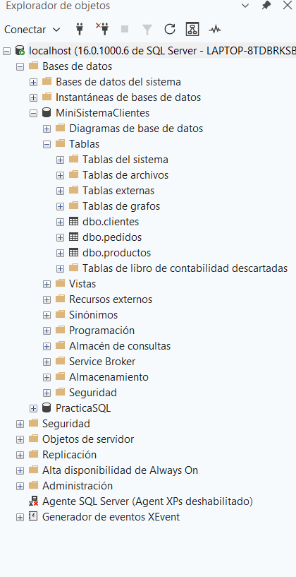
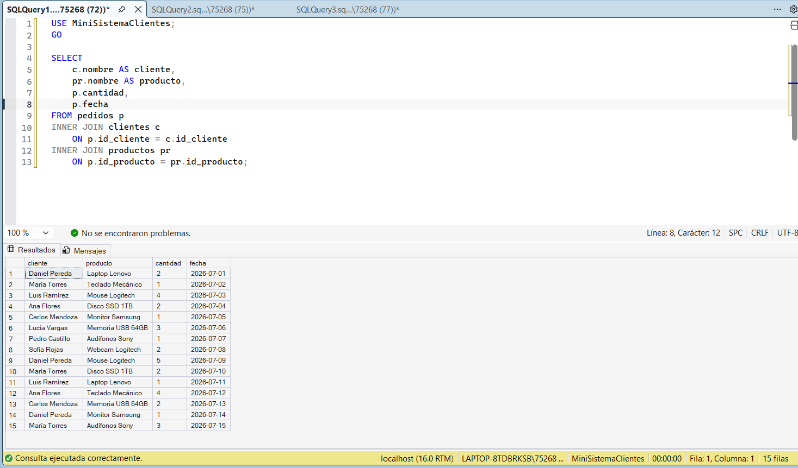
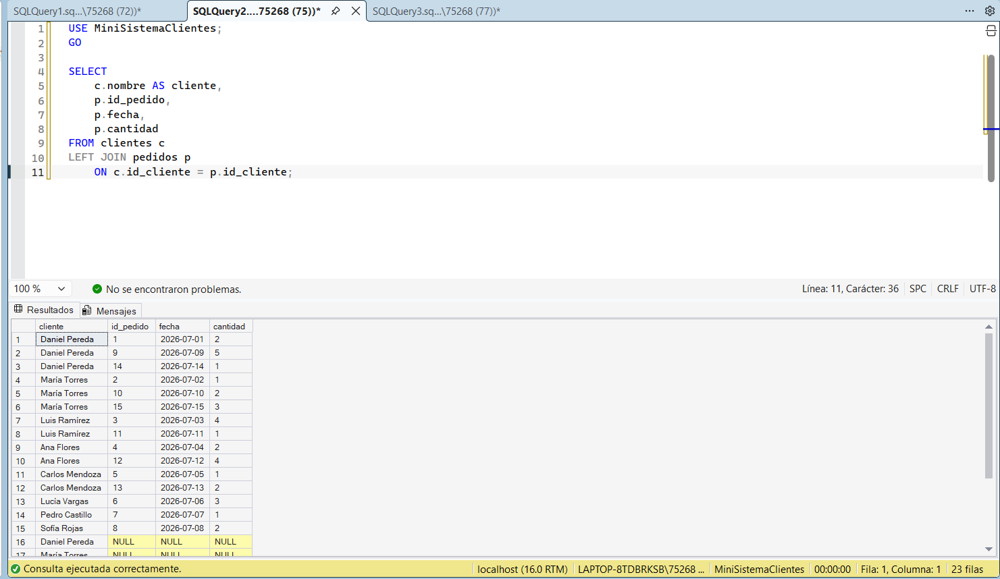
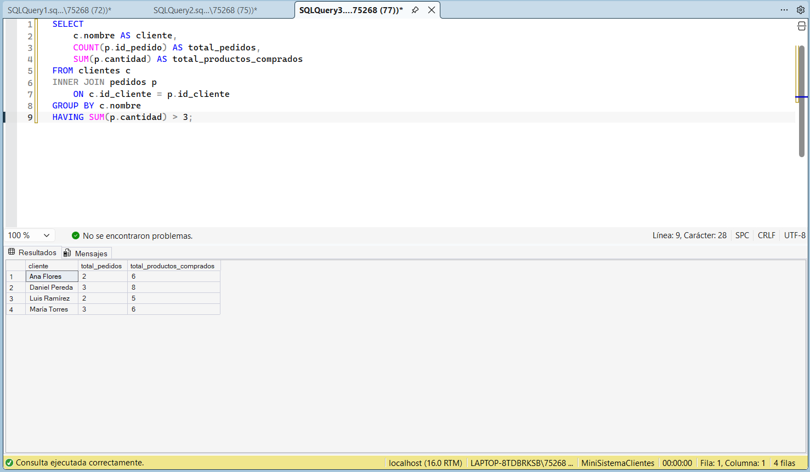

#Mini Sistema de Clientes

Proyecto desarrollado en **SQL Server** para practicar el diseño de bases de datos relacionales y consultas SQL.

---

#Tecnologías utilizadas

- SQL Server
- SQL
- SQL Server Management Studio (SSMS)

---

#Estructura del proyecto

```
MiniSistemaClientes
│
├── database
├── scripts
├── queries
├── images
└── README.md
```

---

#Capturas del proyecto

#Base de datos



---

#INNER JOIN



---

#LEFT JOIN



---

#Reporte de clientes



---

#Consultas implementadas

- SELECT
- WHERE
- LIKE
- BETWEEN
- ORDER BY
- INNER JOIN
- LEFT JOIN
- GROUP BY
- HAVING
- COUNT
- SUM
- MIN
- MAX
- AVG

---

#Cómo ejecutar el proyecto

1. Crear la base de datos.
2. Ejecutar los scripts de la carpeta `database`.
3. Insertar los datos desde la carpeta `scripts`.
4. Ejecutar las consultas de la carpeta `queries`.

---

#Autor

**Daniel Pereda**